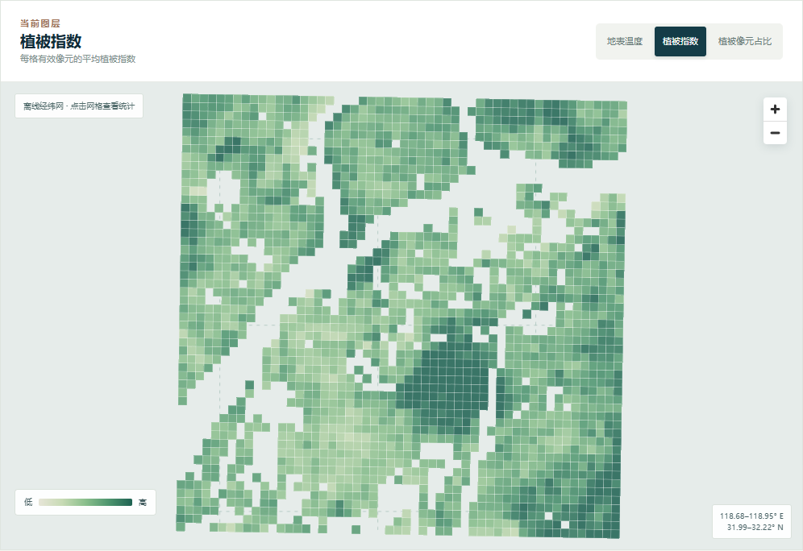

# 南京城市热环境与绿地分析平台

[在线演示](https://wanghan7355608.github.io/nanjing-heat-atlas/) · [数据与方法](docs/methodology.md) · [三分钟复试讲解稿](docs/interview.md)

一个面向 GIS／遥感复试展示的可复现研究作品：从真实 Landsat 8 Level-2 影像出发，完成质量控制、地表温度与 NDVI 计算、500 米空间网格统计，并把结果呈现在可交互 WebGIS 中。



## 研究问题与当前结果

2024 年 8 月 9 日一次卫星过境时，南京主城区样区的陆地地表温度如何分布？网格平均植被指数与地表温度有什么空间关系？

| 指标 | 本景结果 |
| --- | ---: |
| 有效像元比例 | 76.2% |
| 发布的 500 米网格 | 2,046 个 |
| 有效陆地像元平均地表温度 | 45.2 °C |
| 网格平均 NDVI 与平均地表温度的 Pearson r | −0.872 |

**解读边界：**地表温度不是气温；一次过境不能代表长期热岛趋势；相关性不能证明植被单独造成降温。图上留白来自质量筛选，不代表那里没有温度。网格数也不是样本数：LST 的相关长度约 1.3 公里，2046 个网格约相当于 300 个独立样本，所以本项目不报告基于 n = 2046 的显著性检验。

## 作品包含什么

- **遥感处理管线**：通过 Microsoft Planetary Computer STAC 定位 Landsat Collection 2 Level-2 场景，临时签名后用 COG 窗口读取样区，不把整景影像或签名保存进仓库。
- **质量控制与物理量计算**：用 `QA_PIXEL` 排除填充值、云、卷云、云影、雪和水；按产品比例系数计算摄氏地表温度与 NDVI。
- **空间分析**：在 EPSG:32650 中建立 500 米方格，按有效像元覆盖率发布统计，计算高温像元比例、植被占比与描述性相关系数。
- **交互展示**：MapLibre 地图支持地表温度、植被指数、植被像元占比、高温像元占比四个图层切换，以及网格点选、散点图联动、来源清单与方法说明。默认底图为离线经纬网，无需外部地图瓦片服务。
- **空间自相关检查**：从已发布的网格估计 LST 的相关图与相关长度，据此给出有效样本量，避免把 2046 个网格当作 2046 个独立样本。仅依赖标准库。
- **可复现交付**：提交派生 GeoJSON、来源清单、处理代码、自动化测试、GitHub Actions 和复试讲解稿。

## 数据来源

- STAC collection：`landsat-c2-l2`
- Scene：`LC08_L2SP_120038_20240809_02_T1`
- 采集时间：2024-08-09 02:36:55 UTC
- WGS84 样区：`[118.68, 31.99, 118.95, 32.22]`
- 资产：`lwir11`、`red`、`nir08`、`qa_pixel`
- 公开派生数据：[`web/public/data/grids.geojson`](web/public/data/grids.geojson)、[`web/public/data/manifest.json`](web/public/data/manifest.json)

数据与算法细节见[方法文档](docs/methodology.md)。

## 本地运行

需要 Python 3.12 和 Node.js 24。首次安装及重新生成数据需要联网；已经提交的派生数据可直接用于前端演示。

```powershell
python -m pip install -r requirements-dev.txt
python -m pytest -q
python -m heat_atlas.cli
python -m heat_atlas.autocorrelation
cd web
npm ci
npm run dev
```

`python -m heat_atlas.cli` 默认从 README 所列场景重建数据，并覆盖 `web/public/data/` 下两份派生文件。`python -m heat_atlas.autocorrelation` 只读取已提交的派生数据，不需要联网。若只想查看网页，可跳过这一步，在 `web` 目录执行 `npm ci`、`npm run dev`。构建生产版本用 `npm run build`。

## 复试展示建议

按[三分钟讲解稿](docs/interview.md)依次展示：**问题 → 数据与 QA → 地图和散点图 → 结果边界与下一步**。可现场点选高温网格，并解释它的有效覆盖率、NDVI 和温度，而不把高温归因于单一因素。

## 局限与后续研究

当前是单景、单时刻、一个样区的描述性分析。没有地面站验证，也没有控制建筑密度、地形、局地气候区等混杂变量。下一阶段可以加入多时相比较、LCZ 分层和地面观测交叉验证，再讨论稳健性与机制。

## 许可

本仓库代码与 `web/public/data/` 下的派生数据采用 [MIT 许可](LICENSE)。原始 Landsat 影像由 USGS 提供，属公有领域。
